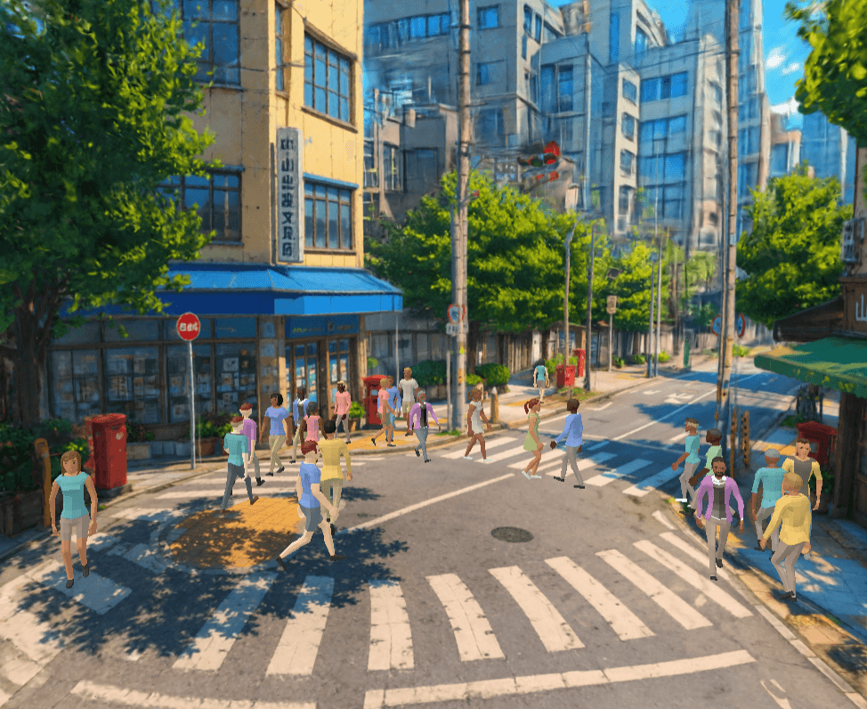

<p align="center">
  
</p>

<p align="center">
  <a href="https://isaac-mason.github.io/lively-crossing/"><b>▶ Live demo</b></a>
</p>

# lively-crossing

An interactive Gaussian-splat scene: a city crossing with wind in the trees and a crowd of pedestrians on the sidewalks, rendered with [Spark](https://github.com/sparkjsdev/spark) in the browser. Use it as a starter for your own interactive splat worlds.

## Stack

| Layer | Library |
| --- | --- |
| Renderer | [Three.js](https://threejs.org) (`WebGLRenderer`) |
| Gaussian splats | [Spark](https://github.com/sparkjsdev/spark) (`SparkRenderer` with streaming LOD `.rad`) |
| Physics | [crashcat](https://www.npmjs.com/package/crashcat) (static triangle-mesh collider) |
| Navigation | [navcat](https://www.npmjs.com/package/navcat) (solo navmesh and crowd steering) |
| Math | [mathcat](https://www.npmjs.com/package/mathcat) |
| Asset bake | [glTF-Transform](https://gltf-transform.dev) with [meshoptimizer](https://github.com/zeux/meshoptimizer) for the collider, Spark `build-lod` for the splat |
| Large assets | [Git LFS](https://git-lfs.com) |
| Language and build | TypeScript with [Vite](https://vite.dev) |
| Lint and format | [Biome](https://biomejs.dev) |

## Quick start

### Requirements

- Node.js 24+ (for Vite 8 and the asset build scripts).
- pnpm (the repo ships a `pnpm-lock.yaml`).
- [Git LFS](https://git-lfs.com) for the splat assets. Run `git lfs install` before cloning, or `git lfs pull` after. See [Large assets](#large-assets-git-lfs).
- A Rust toolchain, only for rebuilding the LOD splat (see [Asset pipeline](#asset-pipeline)). It is not needed to run the bundled scene.

### Install and run

```bash
pnpm install
pnpm dev          # http://localhost:5173
```

### Build for production

```bash
pnpm build        # tsc + vite build, output to dist/
pnpm preview      # serve the production build locally
```

## How it works

A Gaussian splat is only visuals: a cloud of colored blobs, with no floor, walls, or sense of which blobs are trees. The interactive parts come from invisible data aligned with the splat.

**Collider** (`src/physics.ts`, `src/collider.ts`). A triangle mesh of the ground, curbs, and walls. The physics engine ([crashcat](https://www.npmjs.com/package/crashcat)) uses it to know what is solid; pedestrian feet are raycast down onto it so they sit on the real surface.

**Navmesh** (`src/navigation.ts`). An navigation mesh that covers walkable surfaces, that [navcat](https://www.npmjs.com/package/navcat) uses for path-finding.

**Crowd Simulation** (`src/characters.ts`). navcat steers the pedestrians. Each walks a route and avoids the others.

**Characters** (`src/character-visuals.ts`). Draws an animated model per pedestrian, blending idle and walk by speed and facing the direction of travel.

**Wind** (`src/wind.ts`). A shader nudges each splat's position over time to sway the trees. Hand-placed spheres (`WIND_SPHERES`) mark which splats are foliage.

The collider and navmesh are "baked": generated once, offline, from a companion mesh that ships with the splat, then saved as small files the browser loads directly (see [Asset pipeline](#asset-pipeline)).

A loading overlay stays up until enough of the splat is on screen (it counts drawn splats rather than waiting a fixed time). Press backtick (`` ` ``) for a debug panel: collider and navmesh wireframes, a level-of-detail slider, and the wind spheres.

## Asset pipeline

Everything the browser loads is baked offline from a single source splat (`assets/anime-city.spz`, gitignored and never served), so there is no heavy parsing at runtime. `generate:collision-mesh` extracts a plain triangle mesh from the splat, and both the runtime collider and the navmesh are baked from that shared mesh.

```bash
pnpm build:lod                 # public/anime-city-lod.rad        from assets/anime-city.spz
pnpm generate:collision-mesh   # assets/anime-city.collision.glb  from assets/anime-city.spz
pnpm build:collision-mesh-glb  # public/collider.glb              from assets/anime-city.collision.glb
pnpm build:navmesh             # public/navmesh.json              from assets/anime-city.collision.glb
```

| Script | Input | Output | Used by |
| --- | --- | --- | --- |
| [`scripts/build-lod.sh`](scripts/build-lod.sh) | `.spz` splat | `public/anime-city-lod.rad` | `SplatMesh` in `src/splat.ts` |
| [`scripts/generate-collision-mesh.ts`](scripts/generate-collision-mesh.ts) | `.spz` splat | `assets/anime-city.collision.glb` | the two builds below |
| [`scripts/build-collision-mesh-glb.ts`](scripts/build-collision-mesh-glb.ts) | collision mesh | `public/collider.glb` | `src/collider.ts`, then `src/physics.ts` |
| [`scripts/build-navmesh.ts`](scripts/build-navmesh.ts) | collision mesh | `public/navmesh.json` | `src/navigation.ts` |

The runtime collider is baked to a small glTF. Positions are quantized (`KHR_mesh_quantization`) and the mesh is Meshopt-compressed (`EXT_meshopt_compression`), which takes a roughly 1 MB triangle mesh down to about 180 KB. Three's `GLTFLoader` with `MeshoptDecoder` decodes it at load time.

> Note: `build:lod` needs Rust. It runs Spark's `build-lod` tool, which only ships in the Spark source repo, not the npm package. The script shallow-clones Spark (pinned to the version this project uses) into a gitignored `vendor/` dir and runs it with cargo. Install a [Rust toolchain](https://rustup.rs/) for this step. The collider and navmesh steps are plain Node.

## Large assets (Git LFS)

The heavy splat files are stored with [Git LFS](https://git-lfs.com), tracked in `.gitattributes`:

- `public/anime-city-lod.rad` (about 96 MB) is the LOD splat the app renders.
- `assets/anime-city.spz` (about 63 MB) is the source splat, the input to `pnpm build:lod`.

One-time setup (macOS: `brew install git-lfs`, or see [git-lfs.com](https://git-lfs.com)):

```bash
git lfs install   # once per machine, installs the LFS hooks
```

Cloning then pulls the real files. If you cloned before enabling LFS and see small pointer files instead of the assets, run `git lfs pull`.

> GitHub's free LFS tier is 1 GB of storage and 1 GB of bandwidth per month. These two files are about 160 MB, and each Pages deploy checks them out, so frequent deploys use up the monthly bandwidth.

## Deploy (GitHub Pages)

[`.github/workflows/deploy.yml`](.github/workflows/deploy.yml) builds and publishes to GitHub Pages on every push to `main`. You can also run it from Actions, under Deploy to GitHub Pages, Run workflow. It checks out with LFS enabled so the splat assets are real files, runs `pnpm build`, and deploys `dist/`.

The site is served from a project subpath, so the build sets `BASE_PATH=/lively-crossing/`, which `vite.config.ts` reads. Update it if you rename the repo.

One-time repo setting: Settings, then Pages, then set Build and deployment Source to GitHub Actions.

## Version notes

- Spark is pinned (`@sparkjsdev/spark` and the `SPARK_VERSION` in `build-lod.sh`) so the LOD `.rad` format matches the runtime. If you bump Spark, rebuild the `.rad`.

## License

MIT.
